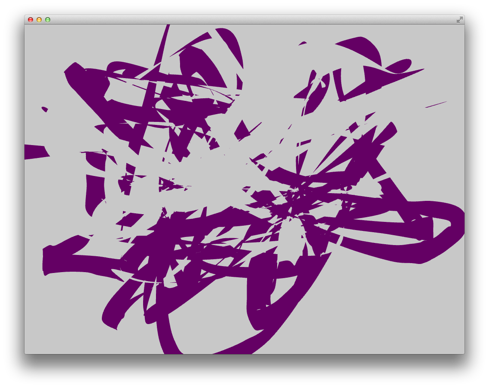

# GFrame

## Visuals
### Möglicherweise nützliche Bibliotheken

* [ofxParticles](https://github.com/timscaffidi/ofxParticles)
	* A CPU Based particle effects addon for openFrameworks.
* [ofxFlowtools](https://github.com/moostrik/ofxFlowTools)
	* Combines 2D fluid simulation, optical flow and more using GLSL shaders. 
	* [Video](https://vimeo.com/92334462)
* [ofxFluid](https://github.com/patriciogonzalezvivo/ofxFluid)
	* Funktioniert out of the box
* [ofxFX](https://github.com/patriciogonzalezvivo/ofxFX)
	* Unlocking the GPU Power on openFrameworks with this add-on for that make easy to use GLSL Shaders
* [ofxMSAFluid](https://github.com/memo/ofxMSAFluid)
	* C++ openFrameworks addon for solving and drawing 2D fluid systems
	* habe das example bisher noch nicht zum laufen bekommen. es kompilierte zwar, aber zeigte nur einen schwarzen Bildschirm. Das Addon ist auch schon einige Jahre auf dem Buckel. Vielleicht liegt es aber auch an meiner fehlenden Grafikkarte im MacBook Air?
* [ofxStrokeUtil](https://github.com/alexiswolfish/ofxStrokeUtil)
	* an openFrameworks addon for comparing/analyzing 2D gestures and contours using ofPath
* [ofxBullet](https://github.com/NickHardeman/ofxBullet)
* [ofxBox2D](https://github.com/vanderlin/ofxBox2d)
* [ofxMSAPhysics](https://github.com/memo/ofxMSAPhysics)
* [ofxGenerative](https://github.com/rezaali/ofxGenerative)
	* ofxGenerative is an addon for openframeworks that helps to create generative systems or dynamical real-time simulations
* [ofxDrawnetic](https://github.com/rezaali/ofxDrawnetic)
	*  ofxDrawnetic is an addon for openframeworks that contains various dynamic/generative brushes and paints for use in generative compositions.
	
	

## Kompilieren der Repository von Robert
https://github.com/der-rob/gFrame

Damit das Kompilieren von ofxOsc funktioniert, müssen ein paar Header Search Paths hinzugefügt werden: 

Außerdem muss Syphon als Linked Framework hinzugefügt werden:

# Styles

## Caligraphy Style

Test mit ofPath. In der Funktion mouseDragged hänge ich die Punkte mit 
`path.lineTo(x, y);` an.

### Abhängigkeit der Liniendicke von der Geschwindigkeit
Idee: Orthogonale Linie zu jedem Linienelement zeichnen und diese Punkte mit einer schönen geglätteten Linie verbinden.

Normalen errechne ich wie [hier](http://stackoverflow.com/questions/1243614/how-do-i-calculate-the-normal-vector-of-a-line-segment) beschrieben: 
> dx=x2-x1 and dy=y2-y1, then the normals are (-dy, dx) and (dy, -dx)

Ohne Glättung sieht der erste Versuch jetzt so aus:

Offene Fragen:

*  Wie bekomme ich da eine schöne Füllung zwischen die beiden Outlines?
*  Wie kann man die outline smoother kriegen?

#### Smoothen der Outline

Versuch mit [ofCurveVertex](http://openframeworks.cc/documentation/graphics/ofGraphics.html#!show_ofCurveVertex)

	for(int all = 0; all<all_outlines1.size(); all++){
	    ofBeginShape();
	    ofVertex(all_outlines1[all][0].loc.x, all_outlines1[all][0].loc.y);
	    for(int cur=1; cur < all_outlines1[all].size();cur++){
	        ofCurveVertex(all_outlines1[all][cur].loc.x, all_outlines1[all][cur].loc.y);
    	}
    	ofEndShape();
    }
    
Und das gleiche auch nochmal für die zweite Outline.

#### Füllung
Indem ich die zweite Outline in den selben for Block schreibe, aber die Reihenfolge umkehre, kann ich den ganzen Shape mit einer Füllung versehen.

	for(int all = 0; all<all_outlines1.size(); all++){
		ofFill();
		ofBeginShape();
		ofVertex(all_outlines1[all][0].loc.x, all_outlines1[all][0].loc.y);
		for(int cur=1; cur < all_outlines1[all].size();cur++){
			ofCurveVertex(all_outlines1[all][cur].loc.x, all_outlines1[all][cur].loc.y);
        }        
        for(int cur=all_outlines2[all].size()-1; cur > 0;cur--){
            ofCurveVertex(all_outlines2[all][cur].loc.x, all_outlines2[all][cur].loc.y);
        }
        ofEndShape();
        ofNoFill();
    }

Das führt aber offensichtlich noch zu Problemen beim Überlappen.

`ofSetPolyMode(OF_POLY_WINDING_POSITIVE);` scheint das Problem zu beheben.

Ich habe den Drawing Style jetzt in eine separate Klasse gepackt. Außerdem habe ich die es nun geschafft, nicht mehr mit zwei verschiedenen Vektoren für aktuellen und alte Linien zu arbeiten indem ich auf das letzte Element von `all_points` mit `all_points.back()` zugreife. Wenn man längere Linien macht ohne abzusetzen gibt es aber Probleme mit der Füllung und es entsteht auch ein Lag.

Vielleicht wäre es einfacher, nicht jedes Mal alles zu zeichnen, sondern einfach das clearen den Screens auszuschalten?
Das geht über `ofSetBackgroundAuto(false);`. Nun reicht es, nur den aktuellen Vektor zu zeichnen. Das Problem ist dann nur noch bei längerem Zeichnen eines Vektors vorhanden. Sobald man absetzt und einen neuen beginnt, ist alles wieder gut.

Ich dachte zuester, dass das mit dem fehlenden redraw ein Problem gibt, wenn es mehrere Benutzer gibt, aber dann kann man ja einfach einen FBO/VBO (?) benutzen den man separat behandeln kann.
Das Problem ist aber, dass beispielsweise ein ausfaden in diesem Fall nicht möglich ist.

###Offene Punkte:

*  Einzelne Punkte werden noch nicht gezeichnet
*  Längeres Zeichnen führt zu einem Lag und Fehler bei der Füllung

## Profile Style

Versuche das mit einem ofMesh zu machen. 

Farbe bekommt man in das Mesh, wenn man nach jedem hinzugefügten Vertex auch eine Farbe hinzufügt:

	meshes.back().addVertex(ofVec3f(lastPoint.x, lastPoint.y-5, 0));
	meshes.back().addColor(ofFloatColor::springGreen);

Da meine Kuben natürlich aus Dreiecken aufgebaut sind, ist es geschickter nicht jeden Vertex mehrfach hinzuzufügen, sondern mit Indizes zu arbeiten.

	mesh.addVertex(point_1);
	mesh.addVertex(point_2);
	mesh.addVertex(point_3);
	mesh.addVertex(point_4);
	
	// 2) CONNECT THE DOTS
    int p4 = mesh.getNumVertices() -1;
    int p3 = p4 - 1;
    int p2 = p3 - 1;
    int p1 = p2 - 1;
    int l4 = p1 - 1;
    int l3 = l4 - 1;
    int l2 = l3 - 1;
    int l1 = l2 - 1;

    // front
    mesh.addIndex(l1);
    mesh.addIndex(l2);
    mesh.addIndex(p1);

    mesh.addIndex(p1);
    mesh.addIndex(p2);
    mesh.addIndex(l2);

    // top
    mesh.addIndex(l1);
    mesh.addIndex(p4);
    mesh.addIndex(p1);      
        
    mesh.addIndex(l1);
    mesh.addIndex(l4);
    mesh.addIndex(p4);

    // back
    mesh.addIndex(l4);
    mesh.addIndex(l3);
    mesh.addIndex(p4);

    mesh.addIndex(l3);
    mesh.addIndex(p3);
    mesh.addIndex(p4);

    // bottom
    mesh.addIndex(l2);
    mesh.addIndex(l3);
    mesh.addIndex(p3);

    mesh.addIndex(l2);
    mesh.addIndex(p2);
    mesh.addIndex(p3);
    
Allerdings scheint es so zu sein, dass ich nur Vertices Farben geben kann und deshalb die unterschiedlichen Seiten nicht unterschiedlich einfärben kann, ohne einen Verlauf zu bekommen.

### Problem mit Überlagerung
Ich habe jetzt länger mit Problemen gekäpft, dass sich überlagernde Flächen nicht richtig funktioniert haben.

Von innen sah es immer ok aus

Zuerst dachte ich, dass es was mit den Normalen zu tun hat. Aber nachdem ich damit rumgespielt have, hat sich keine Veränderung gezeigt.

Beim Durchsehen anderer Beispiele bin ich auf den Befehl `ofEnableDepthTest();` gestoßen, der das Problem dann auch tatsächlich gelöst hat.

### Test mit einfachem Kubus

Um die Normalen für die Beleuchtung richtig hinzubekommen, mache ich einen Test mit einem einfachen Kubus (dem zwei Seiten fehlen). Leider scheint es nicht zu funktionieren, die Normalen mit dem Index-Vorgehen zusammen zu bringen (oder ich weiß nicht wie).

So funktioniert es:

	ofMesh cube;
    
    ofVec3f c1 = ofVec3f(0, 5, 5);
    ofVec3f l1 = ofVec3f(0, 10, 10);
    ofVec3f l2 = ofVec3f(0, 0, 10);
    ofVec3f l3 = ofVec3f(0, 0, 0);
    ofVec3f l4 = ofVec3f(0, 10, 0);
    
    ofVec3f c2 = ofVec3f(10, 5, 5);
    ofVec3f p1 = ofVec3f(10, 10, 10);
    ofVec3f p2 = ofVec3f(10, 0, 10);
    ofVec3f p3 = ofVec3f(10, 0, 0);
    ofVec3f p4 = ofVec3f(10, 10, 0);
    
    ofLine(c1, c2);
    
    ofVec3f normalFront = ((((p2 - p1) / 2) + p1) - c2).normalize();
    ofVec3f normalTop = ((((p4 - p1) / 2) + p1) - c2).normalize();
    ofVec3f normalBack = ((((p3 - p4) / 2) + p4) - c2).normalize();
    ofVec3f normalBottom = ((((p2 - p3) / 2) + p3) - c2).normalize();
    
    // front
    cube.addVertex(l1);
    cube.addNormal(normalFront);
    cube.addVertex(l2);
    cube.addNormal(normalFront);
    cube.addVertex(p1);
    cube.addNormal(normalFront);
    
    cube.addVertex(p1);
    cube.addNormal(normalFront);
    cube.addVertex(p2);
    cube.addNormal(normalFront);
    cube.addVertex(l2);
    cube.addNormal(normalFront);
    
    // top
    cube.addVertex(l1);
    cube.addNormal(normalTop);
    cube.addVertex(p4);
    cube.addNormal(normalTop);
    cube.addVertex(p1);
    cube.addNormal(normalTop);
    
    cube.addVertex(l1);
    cube.addNormal(normalTop);
    cube.addVertex(l4);
    cube.addNormal(normalTop);
    cube.addVertex(p4);
    cube.addNormal(normalTop);
    
    // back
    cube.addVertex(l4);
    cube.addNormal(normalBack);
    cube.addVertex(l3);
    cube.addNormal(normalBack);
    cube.addVertex(p4);
    cube.addNormal(normalBack);
    
    cube.addVertex(l3);
    cube.addNormal(normalBack);
    cube.addVertex(p3);
    cube.addNormal(normalBack);
    cube.addVertex(p4);
    cube.addNormal(normalBack);
    
    // bottom
    cube.addVertex(l2);
    cube.addNormal(normalBottom);
    cube.addVertex(l3);
    cube.addNormal(normalBottom);
    cube.addVertex(p3);
    cube.addNormal(normalBottom);
    
    cube.addVertex(l2);
    cube.addNormal(normalBottom);
    cube.addVertex(p2);
    cube.addNormal(normalBottom);
    cube.addVertex(p3);
    cube.addNormal(normalBottom);
    
    cube.draw();
    

### Anwendung auf Linie
Funktioniert!

Habe außerdem wieder auf GPoints umgestellt und bewege das Mesh entsprechend der Lebensdauer nach hinten.

Zu alte Punkte zu löschen ist mir bisher jedoch noch nicht ohne runtime error gelungen.

### Turning Profile
Nachdem ich das Löschen alter Punkte eingebaut habe, hat sich ein interessanter effekt ergeben: Da die Verdrehung mit der Anzahl der vorherigen Punkte im Mesh zu tun hat und das Mesh in jedem Render-Druchgang neu generiert wird, beginnt dich das Mesh zu winden, wenn die ersten Punkte aus der Liste geschmissen werden. 

### TODO
  * Interpolation?
  * Drehung nicht von der Anzahl der Punkte sondern von der zurückgelegten Strecke abhängig machen
  * Am Ende von Linien und an scharfen Kurven kommt es zu einem Flackern. Könnten das vielleicht Rundungsfehler sein?

## Umgang mit Multitouch

Bisher habe ich ja mit nur einem Cursor gearbeitet, sodass es kein Problem war, zu entscheiden, wann eine Linie abgeschlossen ist und wann eine neue begonnen wird. Ich konnte einfach immer an das letzte Element in der Liste anhängen. Mit Multitouch ist das natürlich etwas anderes. Hier funktioniert mein Listen-in-Listen Konzept nicht mehr.

**Möglichkeit 1) ** Nur noch mit einer Liste arbeiten und Styles und Stroke in die GPoint Metadaten packen. Punkte mit der Gleichen ID und gleicher Quelle werden vermesht.

**Möglichkeit 2) ** es gibt eine begrenzte Anzahl von Fingern (und damit IDs), die der Rahmen detektieren kann. Denkbar wäre es, für jede eine eigene Liste anzulegen.

Es gibt bei TUIO zwei verschiedene Events, die aufgerufen werden: `tuioAdded` und `tuioUpdated`. So wie ich das verstehe, heißt updated, dass sich ein vorhandener Finger bewegt. Das heißt, dass ich immer bei `tuioAdded` die Strokenummer erhöhen muss. 

Der Rahmen erkennt maximal 12 Finger.
Aber 12 Meshes sind natürlich dennoch nicht ausreichend, wenn zwischendrin abgesetzt wurde. 

Ein Mesh gehört also zusammen, wenn alle Punkte die gleiche ID, gleiche source und gleiche Stroke Nummer haben.

=> Meine jetztige Lösungsidee wäre eine Klasse, GPointList Klasse, die intern Listen für die verschiedenen Strokes der verschiedenen IDs führt. 
Irgendwie muss klar sein, welche Liste die aktuelle für jede ID sind. Und wenn dann ein added befehl kommt, muss ein neuer Stroke angefangen werden und der pointer auf die aktuelle Liste aktualisiert werden.

Vielleicht könnte bei dieser Zuordnung eine `std::map` helfen
http://www.cplusplus.com/reference/map/map/

Stroke könnte auch statt einer einfachen Liste auch eine struct sein, die z.B. auch die ID enthält, sodass man sich nicht das erste Child anschauen muss, um zu sehen, wozu er gehört

### Manuelle Korrektur der IDs bzw Gruppierung

## Wo werden die Punkte gespeichert?
In einer Liste, in einer separaten Klasse oder in den Style-Klassen?

Bisher sind sie in den Style-Klassen. Es könnte aber geschickter sein, dass die Style Klassen, nur ein Rendering für die Punktliste darstellen. Dann könnte man die Styles auch im Nachhinein wechseln und die Punkte zentral verwalten.

=> In separate `StrokeList` Klasse gepackt, die sich auch gleichzeitig um die Zusammenfassung in Strokes und die Verwaltung der Listen für die unterschiedlichen Finger kümmert.

### StrokeID
Lokal ändert sich die Stroke-Nummer in der Liste häufig, weil zu alte Strokes ja rausgeschmissen werden. Auch während gezeichnet wird, kann sich diese Zahl ändern. Da diese Aktualisierung der Remote Seite nicht zwangsläufig zum selben Zeitpunkt stattfindet, sollten Stroke Nummern verschickt werden, die länger konsistent sind. Sie sollten hochlaufen und dann evtl. nach einer ausreichend langen Zeit wieder bei 0 anfangen.

Die Nummern werden in den Add-Klassen der `StrokeList` dem `GPoint`zugewiesen. 

# Netzwerk Kommunikation
Prinzipiell würde es ja reichen, wenn die eine Instanz Server wäre und die andere Client. Irgendwie habe ich aber in Erinnerung, dass es einen Grund hatte, weshalb ich bei RTC auf beiden Seiten Client&Server hatte. Nicht nur wegen der Symmetrie, sondern vielleicht auch, weil es bei einem der beiden sehr schwierig war herauszufinden, ob die Verbindung noch steht.

Wenn ich so drüber nachdenke, reicht es bei diesem Projekt ja, nur neue Punkte mit ein paar Metadaten zu übertragen. Vielleicht wäre es deshalb am einfachsten, auch hierfür OSC zu verwenden. Das ist zwar sicher nicht die effizienteste Variante, aber in Anbetracht der geringen Datenmengen vielleicht ausreichend und am komfortabelsten.

Ich habe nun eine Implementierung mit OSC fertiggestellt, die auf meinem Rechner auch ohne größere Probleme läuft.

Allerdings habe ich dann festgestellt, dass OSC mit UDP läuft. Das hat den Nachteil, dass ich keinen Status über die Verbindung habe (es sei denn, ich führe eine Art Herzschlag ein) und noch viel gravierender: Es kann vorkommen dass Daten verloren gehen.

Habe deshalb auf TCP Kommunikation umgestellt. 
Der Einfachheit halber indem ich Strings verschicke.

Beim Test mit Robert wurde die Latenz bei der Nutzung von mehreren Fingern sehr groß, ohne dass der Netzwerk Traffic sehr groß geworden wäre.
Das konnte ich beheben. Das Problem war, dass ich pro Update nur einmal nach neuen Daten gefragt habe. Nun wird so lange gelesen, bis nichts mehr da ist.

Noch immer kommt es aber häufig zu dieser Fehlermeldung:

	[ error ] ofxNetwork: /Users/julianadenauer/CloudStation/Programming/of_v0.8.4/addons/ofxNetwork/src/ofxTCPClient.cpp: 227 ETIMEDOUT: timeout
	
Außerdem bekomme ich einen Laufzeitfehler beim Aufrufen der Funktion `tcp_client.send(s);` wenn die Software auf der anderen Seite beendet wurde.

Habe jetzt ein paar Dinge eingebaut und kann jetzt die beiden Seiten separat schließen und wieder öffnen ohne dass es zu Problemen kommt.

	libc++abi.dylib: terminating with uncaught exception of type Poco::SystemException: System exception
	
## Netzwerk Thread

Wenn `tcp_client.setup(remote_server_ip, remote_server_port);` aufgerufen wird und die IP Adresse `remote_server_ip` nicht existiert, dann hängt das Programm sehr lange. 
Im Forum gibt es eine Diskussion zu diesem Problem: http://forum.openframeworks.cc/t/tcp-client-connection-timeout/11695
Dort wird vorgschlagen, die Verbindungsherstellung in einen Thread zu packen. 

Das habe ich auch getan und mich dazu entschlossen, die Abfrage, ob der Server existiert über einen Ping zu machen, weil das wesentlich schneller geht als den Verbindungstimeout abzuwarten. So wird die Verbindung schneller (wieder)hergestellt.

	    // check if IP is available
        bool server_available;
        string pingStr = (string)"ping -c 1 -t 1 " + remote_server_ip;
        
        int flag = system( pingStr.c_str());
        
        if(flag == 0){
            server_available = true;
            ofLog() << "server is available";
        }else{
            server_available = false;
            ofLog() << "could not connect to server at IP "<<remote_server_ip<<endl;
        }
        
        if(server_available){
            ofLog() << "trying to establish a connection to the remote server: " << ofToString(remote_server_ip) << ":" << ofToString(remote_server_port);
            connected = tcp_client.setup(remote_server_ip, remote_server_port);
            tcp_client.setMessageDelimiter("\n");
            
            if(connected){
                ofLog() << "client is connected to server " << tcp_client.getIP() << ":" << tcp_client.getPort();
            }
        }

### Schützen der Variablen im Thread
Bei den Variablen, die vom Thread und von außen benutzt werden, muss sichergestellt werden, dass es nicht zu konflikten kommt. Sie werden deshalb als protected deklariert und im Thread wird vorher immer `lock()` und nach dem Zugriff `unlock()` aufgerufen. Wenn es sich um eine kurze Funktion handelt, kann man auch mit `ofScopedLock lock(mutex);` den Lock bis zum Ende der Funktion erreichen.

### CPU Auslastung durch Netzwerk-Thread
Die CPU Auslastung ging auch wenn man nicht gezeichnet hat durch den Netzwerk-Thread auf >100% nach oben. Durch einfügen eines `sleep(10)` ging die Auslastung wieder auf <40% zurück.

## Timestamps
In der ersten Implementierung wird von der Runtime der App ausgegangen. Das ist natürlich im vernetzen System problematisch, weil sich die Startzeit der Apps unterscheiden wird. Eigentlich wäre eine gemeinsame Zeitbasis schön, aber wenn ich so drüber nachdenke, ist das wahrscheinlich gar nicht erforderlich, wenn ich stattdessen den Timestamp ignoriere und immer einen neuen lokalen Timestamp erzeuge.
Entweder sind die Daten schnell genug da oder eben auch nicht und dann machen die nachträglich eintreffenden Daten mit richtige Timestamp auch keinen Sinn mehr.

## Flackern
Nachdem ich die Distanzabfrage zum letzten Punkt auch für die Punkte eingebaut habe, die über Netzwerk versendet werden, ist das Flackern wesentlich besser geworden und nur noch dort zu sehen, wo es auch lokal auftritt.

Es war ein Rundungsproblem. Ich konnte es beheben, indem ich den `zIndex` zu einer `float` Variable gemacht habe und bei der Zuweisung einen Cast eingebaut habe

	zIndex = (float) points[all][cur].getTimestamp() - (ofGetElapsedTimeMillis() / 10);

## TODO
  * lokal werden nur neue Punkte aufgenommen, wenn diese weit genug auseinander liegen. Über Netzwerk wird gerade aber alles übertragen. Optionen:
  	* Weglassen der Punkte erst in draw()
  	* Filtern vor dem Versenden
  * sollte die Netzwerk-Übertragung vielleicht direkt in die Style-Klassen integriert werden, statt separat gehandelt zu werden? Dann wäre das mit der Handhabung, welche Punkte übertragen werden und welche nicht natürlich ganz einfach
  * alternative: Trennung zwischen Rendering-Style und der Punkteliste wäre vielleicht eine gute Idee.
  
  
#Netzwerk einrichten
1. Finde deine IP Adresse heraus
   * externe: Internet, z.B. [hiermit](http://www.whatismyip.com) 
   * lokale: in den Netzwerkeinstellungen
2. Port forwarding am Router einstellen
3. Port forwarding testen mit Netzwerkdienstprogramm und laufender Software
4. Adresse des remote computer eingeben

#Offene Themen
  * Unterschiedliche Screen-Größen! Wie ist damit umzugehen?
    * dafür hat Robert ja die Syphon Anbindung eingebaut, um das ganze nochmal durch den Madmapper zu jagen! Mal mit ihm besprechen, wie er sich das vorstellt
    
    
    
# Test 12.11.2014
* Mit den PQLabs anbindung kommt man nicht ganz bis zum Rand, mit TUIO auch nicht
* reaktion auf maus sollte einstellbar sein
* dmx funktioniert noch nicht
* zeit für das Löschen der Punkte einstellen
* verbindet häufig nicht zusammengehörige linien!!!
* dmx stecker scheint kaputt zu sein
* dmx darf nicht die farben durchwechseln!
* lifetime einstellbar machen
* effekte!
* evtl interpolation für punkte, weil oft kurze abreißer drin sind
* min z-speed muss kleiner sein
* vordere sollten auf hintere einen schatten werfen
* cpu auslastung auf macmini ist viel zu hoch!
* syphon output spiegelt sich unten, wenn man oben eine linie zieht